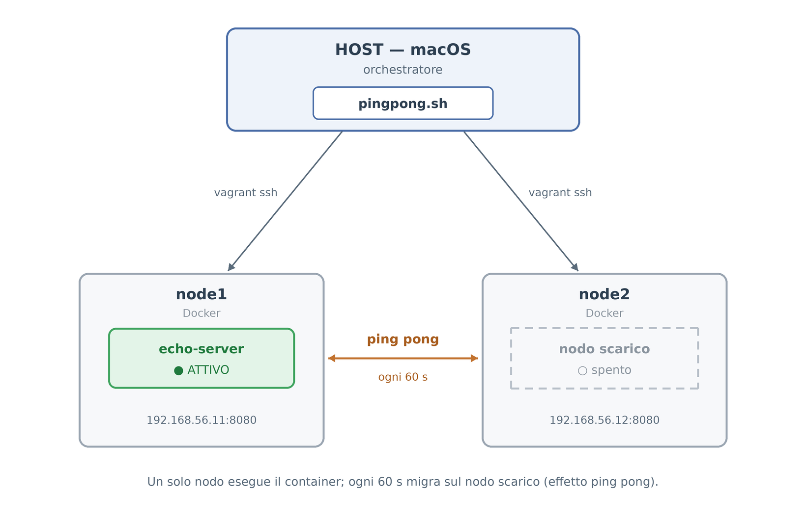

# Ping Pong — Vagrant + Docker

Due nodi Linux gestiti con Vagrant, entrambi con
Docker. Un solo nodo alla volta esegue il container
`ealen/echo-server`: ogni 60 secondi
il container "migra" sul nodo libero, creando un effetto ping pong.

## Obiettivo

Realizzare un progetto Vagrant a due nodi in cui un solo nodo alla volta fa
girare il container `ealen/echo-server`. Ogni 60 secondi il container deve spostarsi
sul nodo "scarico", rimbalzando da un nodo all'altro.

## Come funziona



Installazione di `doker` all'interno dei nodi tramite Vagrantfile.

Lo script `pingpong.sh` gira sull'host (macOS) e fa da **orchestratore**: tramite
`vagrant ssh` comanda Docker su ciascun nodo. Il ciclo, ripetuto all'infinito, è
sempre lo stesso:

```
spegni il container dove gira  -->  accendilo sull'altro nodo  -->  aspetta 60 secondi
```

All'avvio lo script chiede conferma (`s/n`); una volta partito, stampa il round
corrente e quale nodo è attivo. Con `Ctrl+C` si ferma in modo pulito, spegnendo il
container su entrambi i nodi.

## Scelte progettuali

**Migrare un servizio *stateless*.** `echo-server` non conserva alcuno stato tra una
richiesta e l'altra. Per un servizio così, "migrare" non richiede tecniche complesse: basta spegnere il container su un nodo e
accenderne uno identico sull'altro. Il risultato è indistinguibile da una
migrazione "vera", perché non c'è nulla da preservare.

**Un solo container alla volta.** Viene sempre eseguito un solo container alla volta in quanto avviene prima lo stop e poi lo start. In questo modo c'è un momento di switch in cui nessun nodo è attivo per garantire che ci sia sempre e solo un nodo attivo alla volta.

**Orchestratore in Bash sull'host.** Funziona tramite SSH che non serve configurare poiché `vagrant ssh` è già funzionante da host. Lo
script è idempotente (un `docker rm -f` prima di ogni avvio rimuove eventuali residui),
quindi è ri-lanciabile anche dopo un'interruzione.

## Avvio

```bash
vagrant up          # crea i due nodi e installa Docker
./pingpong.sh       # rispondi 's' per avviare
```

Per fermare: `Ctrl+C` (lo script spegne i container su entrambi i nodi).

## Verifica

In un secondo terminale:

```bash
./watch.sh
```

Deve risultare sempre **un solo** nodo `ATTIVO`, che cambia ogni 60 secondi. In
alternativa, a mano:

```bash
curl 192.168.56.11:8080    # node1
curl 192.168.56.12:8080    # node2
```

Risponde solo il nodo che in quel momento esegue il container.
